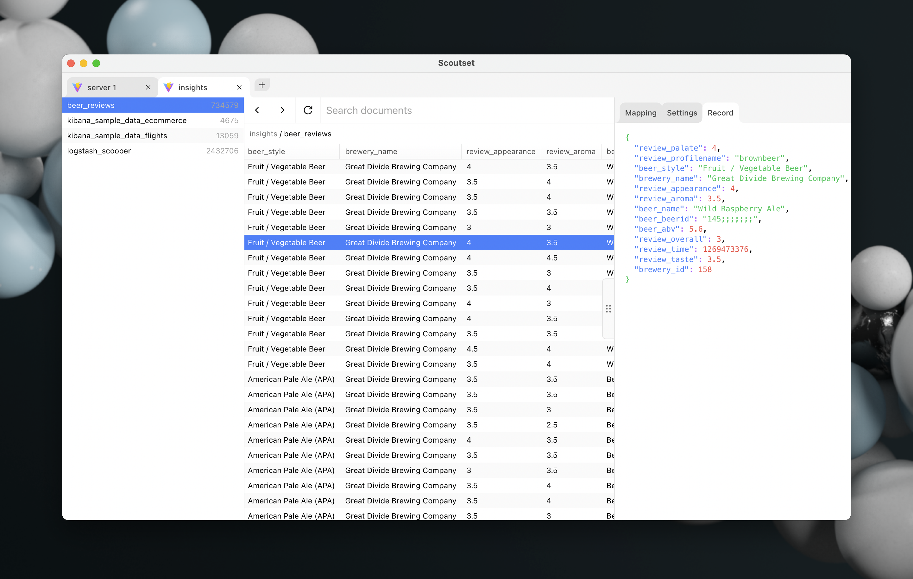

# Scoutset

<p align="center">
  <a href="docs/media/screenshot.png" target="_blank" rel="noopener noreferrer">
    
  </a>
</p>

> A lightweight desktop application for exploring and querying Elasticsearch data.

Scoutset gives you a fast, visual way to browse indices, search documents, and inspect mappings without needing a full Kibana setup. Built with Vue 3 and Electrobun.

## Features

- **Multiple connections** - Manage and switch between Elasticsearch servers
- **Tabbed interface** - Open multiple projects side by side
- **Index browser** - View all indices with document counts
- **Document table** - Paginated display of records with full-text search
- **Data inspector** - Expandable JSON tree view for individual documents
- **Mapping & settings viewer** - Inspect index field mappings and configuration
- **HTTPS support** - Works with self-signed certificates

## Tech Stack

| Layer    | Technology                            |
| -------- | ------------------------------------- |
| Frontend | Vue 3, TypeScript, Tailwind CSS, Vite |
| Desktop  | Electrobun (Bun-based)                |
| Runtime  | Bun                                   |

## Prerequisites

- [Bun](https://bun.sh/) installed
- [Electrobun CLI](https://electrobun.dev/) installed

## Getting Started

Install dependencies:

```sh
bun install
```

Run in development mode:

```sh
bun run dev
```

Run in development mode with hot module replacement:

```sh
bun run dev:hmr
```

Build the application:

```sh
bun run build
```

## Developer

Format code:

```sh
bun run fmt
```

Check formatting without writing changes:

```sh
bun run fmt:check
```

Lint code:

```sh
bun run lint
```

Lint and auto-fix:

```sh
bun run lint:fix
```

## Project Structure

```
src/
├── bun/          # Main process - RPC handlers, window setup, settings storage
├── mainview/     # Vue frontend - screens, components, compositions
└── shared/       # Shared RPC type definitions
```

## License

[MIT](LICENSE) - Roy Teusink
